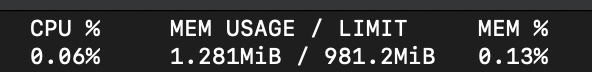

## Sticker Eater

一个 Telegram 群组贴纸自动删除 bot

内存占用:



## Usage

直接运行:

```sh
export TELEGRAM_BOT_TOKEN=your_bot_token
cargo run --release
```

docker:

```sh
docker run -d -e TELEGRAM_BOT_TOKEN=your_bot_token docker.pkg.github.com/darkskygit/sticker_eater/sticker_eater:latest
```